# How to make your own Rover

#### 1. Upgrade your Pi and install the latest version of Python

#### 2. Set up an AP on the Pi
Follow this [tutorial](https://www.raspberrypi.org/documentation/configuration/wireless/access-point.md) to set up your Raspberry Pi as an AP

#### 3. Install these packages on the Pi
In the terminal of the Pi, type:   
```
sudo apt-get install build-essential python-dev
```

#### 4. Enable I<sup>2</sup>C on the Pi
In the Pi terminal, type:
```
sudo raspi-config
```
And there, in "Interafcing Options", select I<sup>2</sup>C and confirm that.
You need to reboot your Pi after this.

#### 5. Install Python smbus2 package
In the Pi terminal, type:
```
sudo pip3 install smbus2
```

#### 6. Install pigpio library
In the Pi terminal, type:
```
wget abyz.co.uk/rpi/pigpio/pigpio.zip
unzip pigpio.zip
cd PIGPIO
make
sudo make install
```

#### 7. Copy the Rover program
Copy the content of the `Rover/Python/` directory somewhere to your Pi.

#### 8. Get the PCB, electronic and Lego parts
...and assemble that.
Buy 4 1nF capacitors more than it is in the schematics. They will be soldered from the motor terminals to the motor shield.   
PCB layout can be found in the `PCBs_schematics/PCB-Layout/` directory. You can order it for example from [JLCPCB](https://jlcpcb.com).   
Some things I used specifically:
-[sensor](https://www.ebay.com/itm/Sharp-GP2Y0A710K0F-IR-Range-Sensor-100-550cm-Infrared-Proximity-Measure-distance/321873113256?epid=2256191608&hash=item4af121f0a8:g:ZYwAAOSw9r1WAVJC)
-[servo](http://hitecrcd.com/products/servos/sport-servos/analog-sport-servos/hs-422-deluxe-standard-servo/product)
-[main motor](https://www.ebay.com/itm/320911868255)
-[sensor motor](https://www.ebay.com/itm/6-12V-100-200-300-30RPM-Mini-DC-Metal-Gear-Motor-Gearwheel-Shaft-Diameter-N20/182498725375?ssPageName=STRK%3AMEBIDX%3AIT&var=485067902164&_trksid=p2057872.m2749.l2649)
(6V 200rpm version)
-[gears](https://www.ebay.com/itm/85Pcs-Plastic-Gears-Rack-Pulley-Belt-Worm-Teeth-Shaft-Car-Toy-Models-Part-DIY/152738933090?ssPageName=STRK%3AMEBIDX%3AIT&_trksid=p2057872.m2749.l2649)
-Li-Pol 3S 1300mAh battery
-[slip ring](https://www.ebay.com/itm/12-5mm-300Rpm-Capsule-Tiny-Slip-Ring-12-Circuits-Wires-2A-240V-Test-Equipment-/141778019951?hash=item2102a0e66f)

#### 9. Assemble the sensor holder
I used a balsa wood.   
For example like this:
1. Make bigger hole in the gear, so that it fits the slip ring
3. Make this:   
The diameter of the disc is roughly 6cm.   
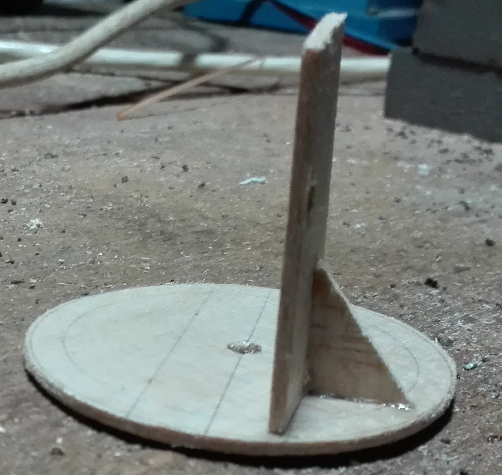
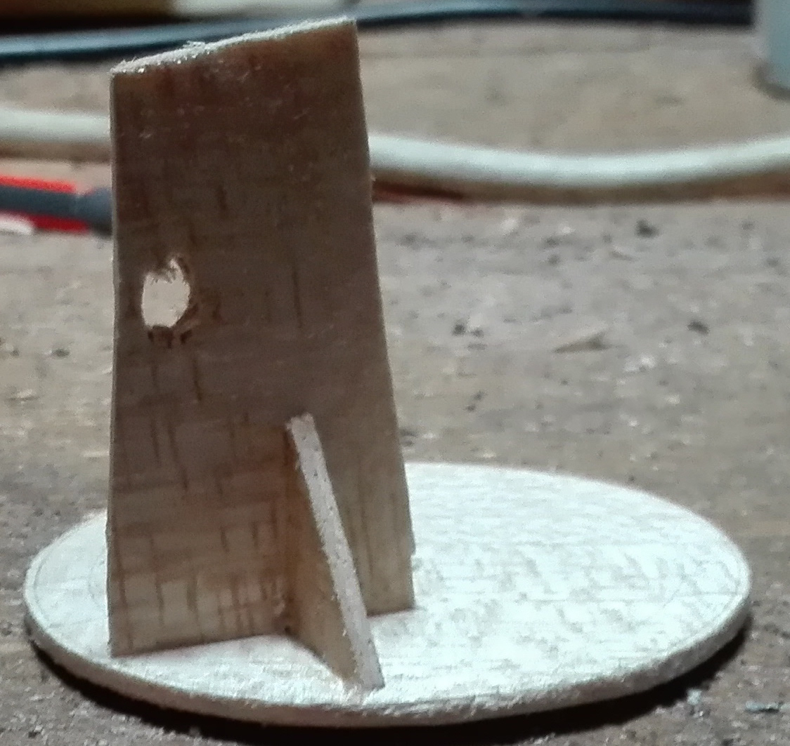
4. Glue a balsa disc to the gear and drill a hole in the middle:   
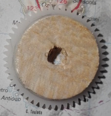
5. Glue that it to the holder:   
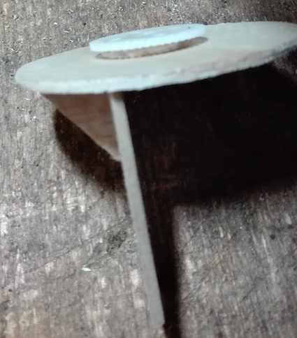
6. Glue the holder to the slip ring.
6. Make a balsa plate:  
The dimensions are roughly 6.5cm x 9.5cm. The holes form a rectangle 8cm x 4.8cm.  
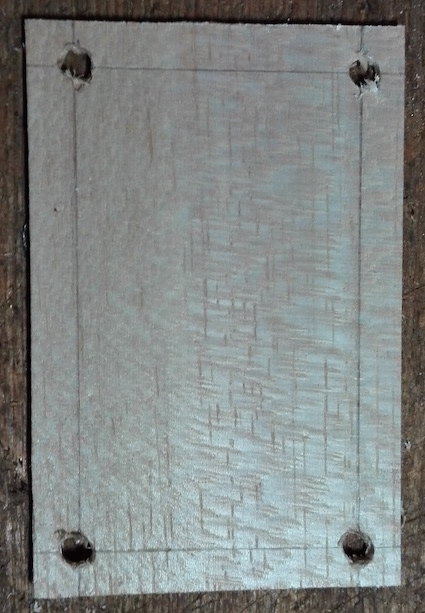
7. Make a hole in the plate for the slip ring, the motor that rotates with the sensor and the optolatch.
8. Mount the slip ring and the motor (already with its gear) to the plate (I mounted it to a Lego supportive skeleton):   
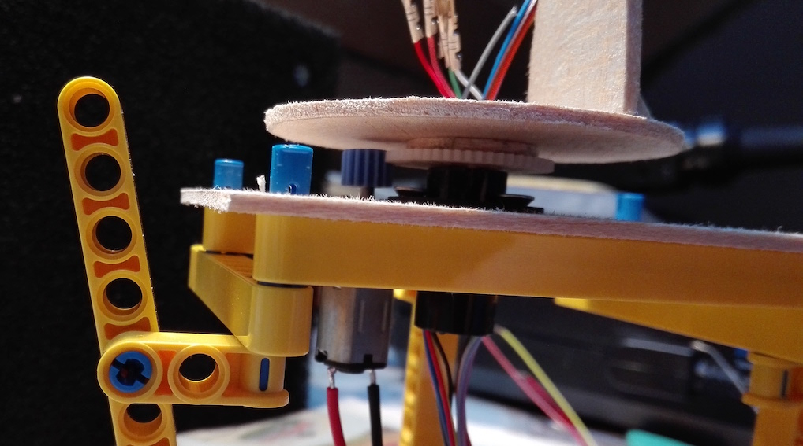   
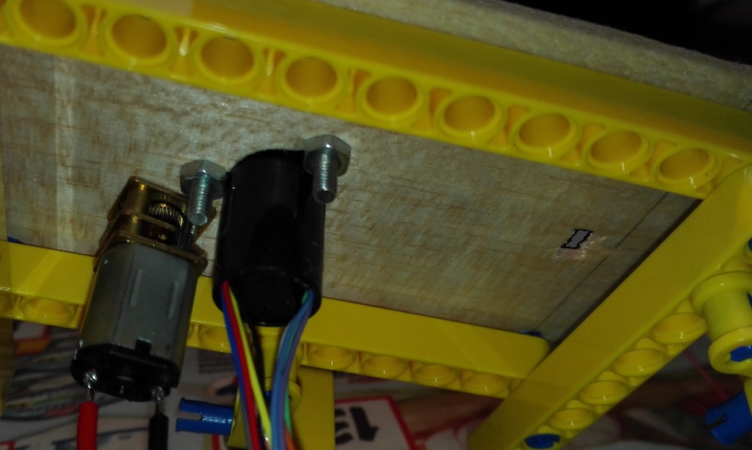
9. Solder a connector for the sensor:  
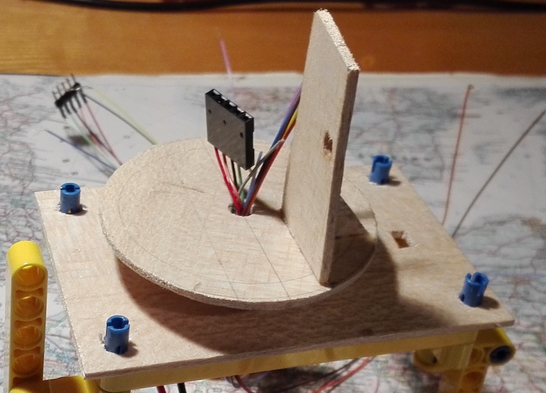
10. Solder a connector to the wire going from the sensor and screw the sensor to the holder:  
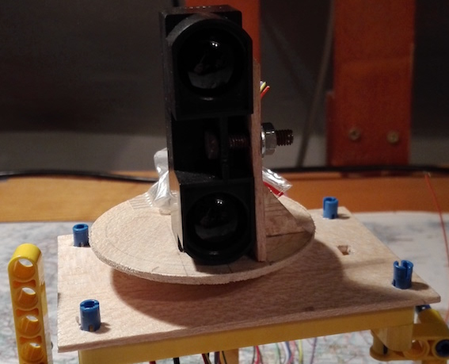
11. Add counterweight to the other side of the holder (I used lead marbles. It should weight the same as the sensor):  
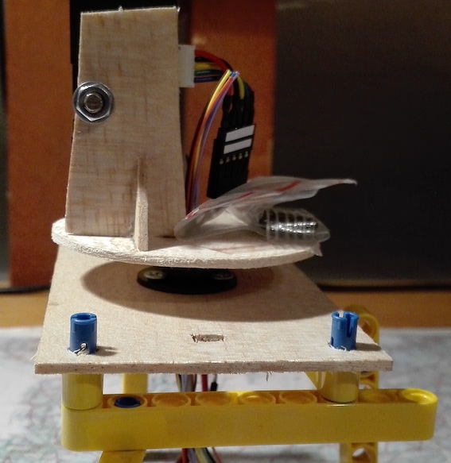
12. Create a holder for the opto-latch and mount it:  
  
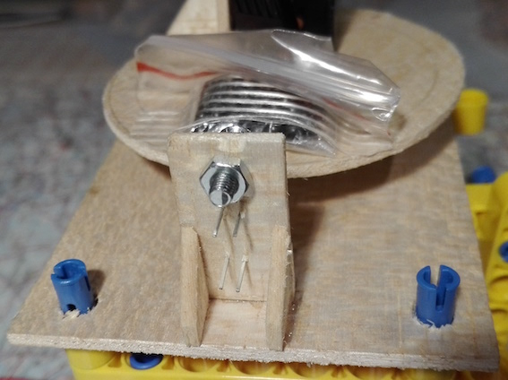  
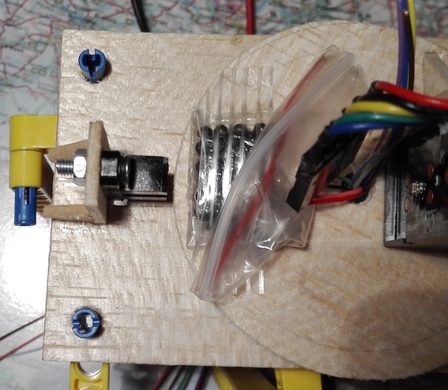
13. Create a protrusion from balsa wood and glue it to the disc. I needs to be in such a way, that it goes through the optolatch in every rotation:  
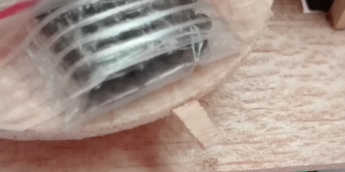
14. To strenghten the servo mount, you can glue there a stick with an epoxid glue:  
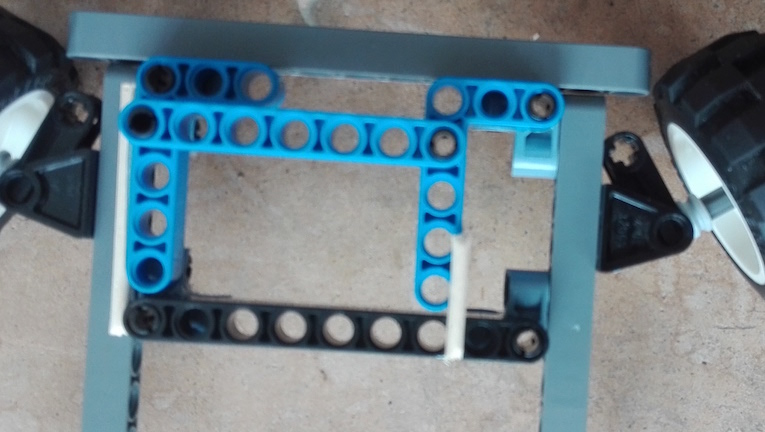  
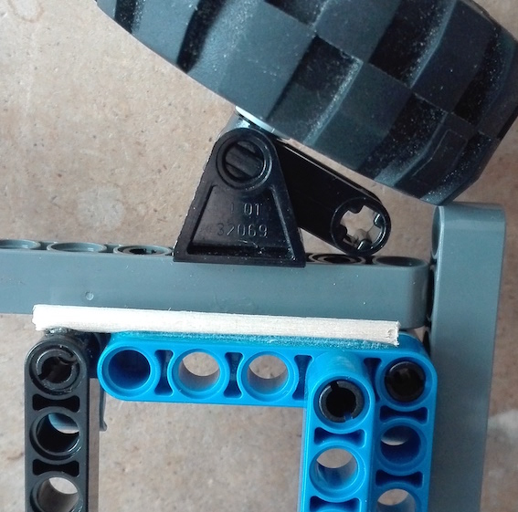
15. Solder the 1nF capacitors between motor terminals and motor shields:
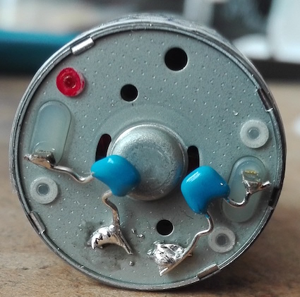   
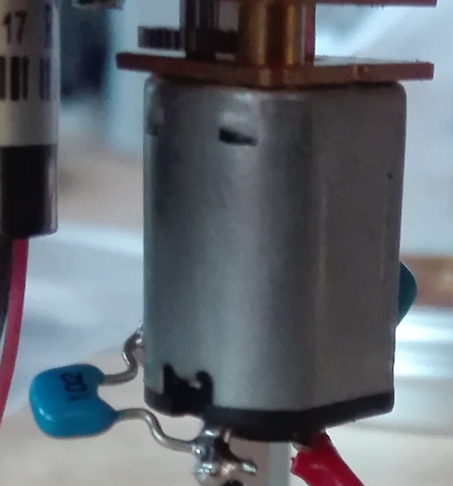
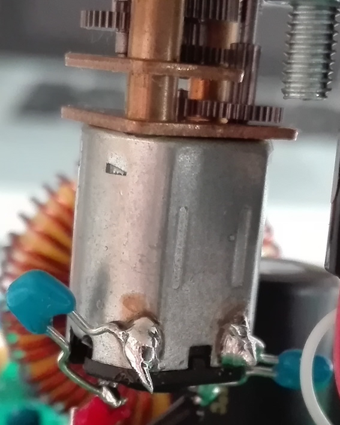