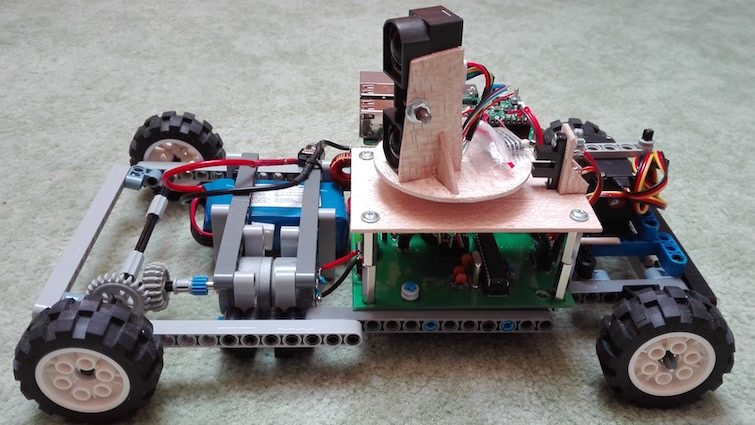

# Rover
This repository contains my school project. It is a remote control car with rotating lidar. The car is controled from a custom Java app.   
If you want the documentation to be translated o English, raise an issue and I will try to translate it as soon as possible. ;-)

[Link](https://ondrejmasopust.github.io/Rover/) to the official website with a documentation.

   
