English below

# Jak postavit Rover

#### 1. Zaktualizujte si svoje Raspberry Pi a nainstalujte si nejnovější verzi Python

#### 2. Nastavte si AP na svém Pi
Podle tohoto [tutoriálu](https://www.raspberrypi.org/documentation/configuration/wireless/access-point.md).

#### 3. Nainstalujte si tyto balíčky na svém Pi
V terminálu pusť tento příkaz:   
```
sudo apt-get install build-essential python-dev
```

#### 4. Povolte I<sup>2</sup>C na Pi
V terminálu pusťte tento příkaz:
```
sudo raspi-config
```
V "Interafcing Options" vyberte I<sup>2</sup>C a potvrďte to.  
Po tomto kroku je potřeba Pi restartovat. (budete vyzváni)

#### 5. Nainstalujte balíček Python smbus2
V terminálu pusťte tento příkaz:
```
sudo pip3 install smbus2
```

#### 6. Nainstalujte knihovnu pigpio
V terminálu pusťte tyto příkazy:
```
wget abyz.co.uk/rpi/pigpio/pigpio.zip
unzip pigpio.zip
cd PIGPIO
make
sudo make install
```

#### 7. Nakopírujte program pro Rover
Nakopírujte obsah složky `Rover/Python/` někam do svého Pi.

#### 8. Pořiďte si plošmý spoj, elektronické součástky a Lego kostičky
Potřebujete všechny součástky, které jsou ve schématu.  
Kupte o 4 1nF kondenzátory více, než je v schématu. Budou připájeny mezi vývody motorů a obal motorů.   
V plošném spoji vyvrtejte díry pro držák senzoru a distanční sloupky na Pi.  
...a spájejte plošný spoj.   
Rozložení plošného spoje lze najít ve složce `PCBs_schematics/PCB-Layout/`. Soubory jsou vytvořeny pomocí programu [KiCad](http://kicad-pcb.org)
Plošný spoj si můžete objednat například od [JLCPCB](https://jlcpcb.com).   
Až si budete kupovat Lego kostičky, nekupujte "connector pegy" bez třecích výstupků. Konstrukce by pak nebyla tak pevná.  
Některé konkrétní věci, co jsem použil :
- [senzor](https://www.ebay.com/itm/Sharp-GP2Y0A710K0F-IR-Range-Sensor-100-550cm-Infrared-Proximity-Measure-distance/321873113256?epid=2256191608&hash=item4af121f0a8:g:ZYwAAOSw9r1WAVJC)
- [servo](http://hitecrcd.com/products/servos/sport-servos/analog-sport-servos/hs-422-deluxe-standard-servo/product)
- [hlavní motor](https://www.ebay.com/itm/320911868255)
- [senzorový motor](https://www.ebay.com/itm/6-12V-100-200-300-30RPM-Mini-DC-Metal-Gear-Motor-Gearwheel-Shaft-Diameter-N20/182498725375?ssPageName=STRK%3AMEBIDX%3AIT&var=485067902164&_trksid=p2057872.m2749.l2649)
(verze 6V 200rpm)
- [převody](https://www.ebay.com/itm/85Pcs-Plastic-Gears-Rack-Pulley-Belt-Worm-Teeth-Shaft-Car-Toy-Models-Part-DIY/152738933090?ssPageName=STRK%3AMEBIDX%3AIT&_trksid=p2057872.m2749.l2649)
- Li-Pol 3S 1300mAh baterie
- [slip ring](https://www.ebay.com/itm/12-5mm-300Rpm-Capsule-Tiny-Slip-Ring-12-Circuits-Wires-2A-240V-Test-Equipment-/141778019951?hash=item2102a0e66f)
- [optozávora](https://www.gme.cz/tcst2103)

#### 9. Sestavte držák na senzor
Použil jsem balsové dřevo.
1. V převodu udělejte větší díru
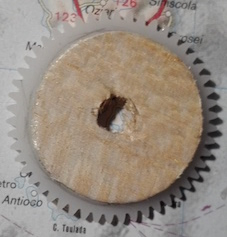
3. Z balsy vyřízněte kotouč o průměru cca. 6cm, malý trojúhelníček jako podpěru a kus balsy, do kterého vyvrtáte díru pro šroub,
kterým přišroubujete samotný senzor - tento kus musí být dost velký na to, aby mohla být díra na správném místě.
Přesné rozměry si určete podle velikosti senzoru. 
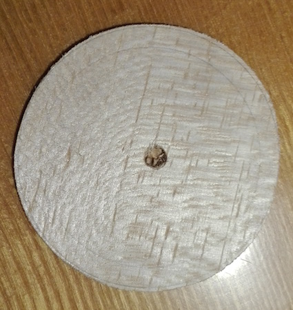

   


4. Přilepte balsový kotouč (o něco menší než převod) k převodu a vyvrtejte uprostřed díru:   

5. Přilepte to k držáku:   
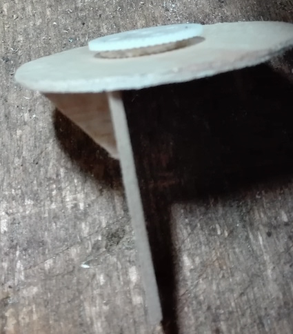
6. Přilepte držák ke slip ring
6. Udělejte balsovou destičku:  
Rozměry jsou přibližně 6,5cm x 9,5cm. Díry tvoří obdélník o rozměrech cca. 8cm x 4.8cm.  
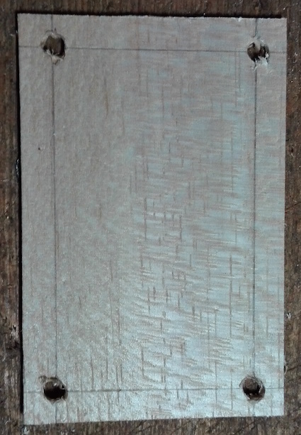
7. Do destičky udělejte díru pro slip ring, senzorový motor a optozávoru.
8. Upevni k destičce slip ring a motor (už s převodem). (Na obrázku jsem si to připevnil na pomocnou konstrukci z Lega):   
   
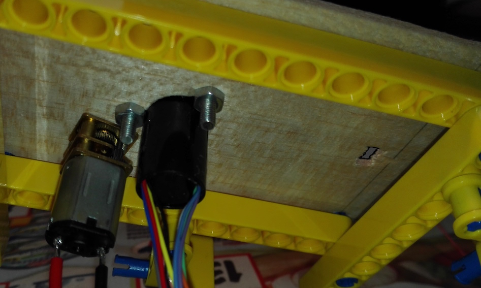
9. Připájejte konektor pro senzor:  

10. Připájejete konektor ke kabelu jdoucímu ze senzoru a přišroubujte senzor k držáku:  

11. Přidejte protizávaží naproti senzoru (Já jsem použil olověné kuličky. Měly by vážit stejně jako senzor):  
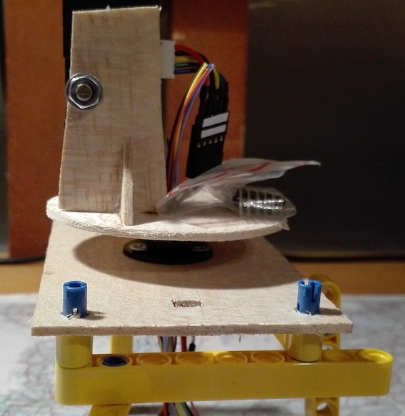
12. Vytvořte držák pro optozávoru a připevněte ji:  
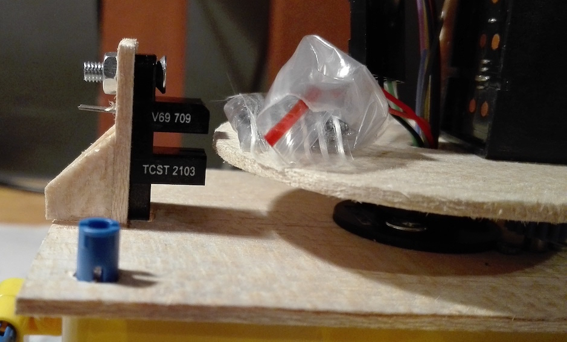  
  

13. Vyřízněte malý jazíček z balsy a přilepte ho ke kotouči. Musí to být uděláno tak, aby při každé otáčce prošel jazíček optozávorou:  
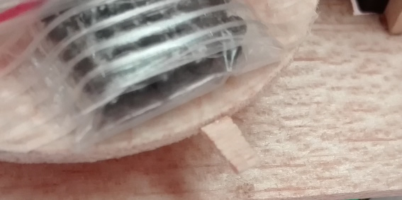
14. Pro zpevnění držáku na servo k němu můžete přilepit několik špejlí epoxidovým lepidlem:  
  
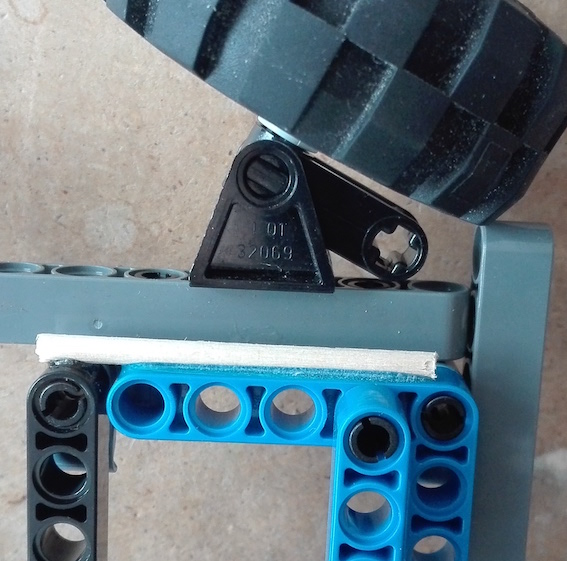
15. Připájejte 1nF kondenzátory mezi vývody motorů a obal motorů (jak hlavní motor, tak i motor, co točí senzorem):
   

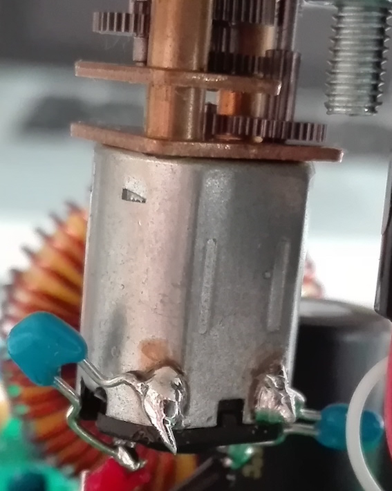

#### 10. Připájejte kabely s konektory ke konektoru, který připevníte k GPIO:
(Je dobrý nápad je také označit)   

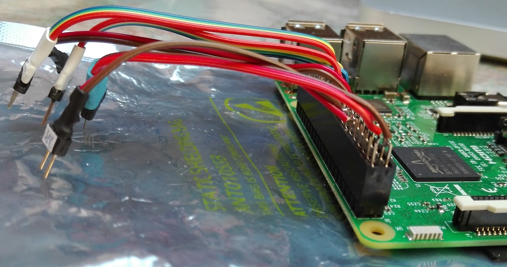

#### 11. Připevněte Pi a senzor k plošnému spoji


#### 12. Všechno sestavte

    
    
# How to make your own Rover

#### 1. Upgrade your Pi and install the latest version of Python

#### 2. Set up an AP on the Pi
Follow this [tutorial](https://www.raspberrypi.org/documentation/configuration/wireless/access-point.md) to set up your Raspberry Pi as an AP

#### 3. Install these packages on the Pi
In the terminal of the Pi, type:   
```
sudo apt-get install build-essential python-dev
```

#### 4. Enable I<sup>2</sup>C on the Pi
In the Pi terminal, type:
```
sudo raspi-config
```
And there, in "Interafcing Options", select I<sup>2</sup>C and confirm that.
You need to reboot your Pi after this.

#### 5. Install Python smbus2 package
In the Pi terminal, type:
```
sudo pip3 install smbus2
```

#### 6. Install pigpio library
In the Pi terminal, type:
```
wget abyz.co.uk/rpi/pigpio/pigpio.zip
unzip pigpio.zip
cd PIGPIO
make
sudo make install
```

#### 7. Copy the Rover program
Copy the content of the `Rover/Python/` directory somewhere to your Pi.

#### 8. Get the PCB, electronic and Lego parts
Drill holes for the sensor holder and the Pi.  
Buy also 4 more 1nF capacitors than there are in the schematics. They will be soldered from the motor terminals to the motor shield.   
...and assemble the PCB.   
PCB layout can be found in the `PCBs_schematics/PCB-Layout/` directory. You can order it for example from [JLCPCB](https://jlcpcb.com).   
If you buy the Lego parts, do not buy the connector pegs without friction pads. The construction won't be as robust as with the friction pads.
Some things I used specifically:
- [sensor](https://www.ebay.com/itm/Sharp-GP2Y0A710K0F-IR-Range-Sensor-100-550cm-Infrared-Proximity-Measure-distance/321873113256?epid=2256191608&hash=item4af121f0a8:g:ZYwAAOSw9r1WAVJC)
- [servo](http://hitecrcd.com/products/servos/sport-servos/analog-sport-servos/hs-422-deluxe-standard-servo/product)
- [main motor](https://www.ebay.com/itm/320911868255)
- [sensor motor](https://www.ebay.com/itm/6-12V-100-200-300-30RPM-Mini-DC-Metal-Gear-Motor-Gearwheel-Shaft-Diameter-N20/182498725375?ssPageName=STRK%3AMEBIDX%3AIT&var=485067902164&_trksid=p2057872.m2749.l2649)
(6V 200rpm version)
- [gears](https://www.ebay.com/itm/85Pcs-Plastic-Gears-Rack-Pulley-Belt-Worm-Teeth-Shaft-Car-Toy-Models-Part-DIY/152738933090?ssPageName=STRK%3AMEBIDX%3AIT&_trksid=p2057872.m2749.l2649)
- Li-Pol 3S 1300mAh battery
- [slip ring](https://www.ebay.com/itm/12-5mm-300Rpm-Capsule-Tiny-Slip-Ring-12-Circuits-Wires-2A-240V-Test-Equipment-/141778019951?hash=item2102a0e66f)
- [opto-latch](https://www.gme.cz/tcst2103)

#### 9. Assemble the sensor holder
I used a balsa wood.   
For example like this:
1. Make bigger hole in the gear, so that it fits the slip ring
3. Make this:   
The diameter of the disc is roughly 6cm.   


4. Glue a balsa disc to the gear and drill a hole in the middle:   

5. Glue it to the holder:   

6. Glue the holder to the slip ring.
6. Make a balsa plate:  
The dimensions are roughly 6.5cm x 9.5cm. The holes form a rectangle 8cm x 4.8cm.  

7. Make a hole in the plate for the slip ring, the motor that rotates with the sensor and the optolatch.
8. Mount the slip ring and the motor (already with its gear) to the plate (I mounted it to a Lego supportive skeleton):   
   

9. Solder a connector for the sensor:  

10. Solder a connector to the wire going from the sensor and screw the sensor to the holder:  

11. Add counterweight to the other side of the holder (I used lead marbles. It should weight the same as the sensor):  

12. Create a holder for the opto-latch and mount it:  
  
  

13. Create a protrusion from balsa wood and glue it to the disc. I needs to be in such a way, that it goes through the optolatch in every rotation:  

14. To strenghten the servo mount, you can glue there some sticks with an epoxid glue:  
  

15. Solder the 1nF capacitors between motor terminals and motor shields (both sensor motor and main motor):
   


#### 10. Solder wires with connectors to the Pi header:
(It is also a good idea to label them)   


#### 11. Mount the Pi and the sensor to the PCB


#### 12. Assemble everything together and make the final Rover!!!
