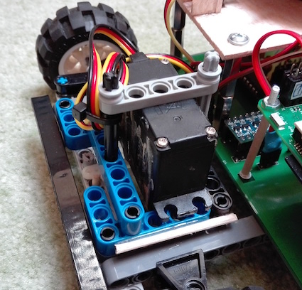

# Stručný návod, jak postavit Rover

#### 1. Zaktualizujte si svoje Raspberry Pi

#### 2. Nastavte si AP na svém Pi
Podle tohoto [tutoriálu](https://www.raspberrypi.org/documentation/configuration/wireless/access-point.md).

#### 3. Nainstalujte si tento balíček na svém Pi
V terminálu spusťte tento příkaz:   
```
sudo apt-get install python-dev
```

#### 4. Povolte I<sup>2</sup>C na Pi
V terminálu spusťte tento příkaz:
```
sudo raspi-config
```
V "Interafcing Options" vyberte I<sup>2</sup>C a potvrďte to.  
Po tomto kroku je potřeba Pi restartovat. (budete vyzváni)

#### 5. Nainstalujte balíček Python smbus2
V terminálu spusťte tento příkaz:
```
sudo pip3 install smbus2
```

#### 6. Nainstalujte knihovnu pigpio
V terminálu spusťte tyto příkazy:
```
wget abyz.co.uk/rpi/pigpio/pigpio.zip
unzip pigpio.zip
cd PIGPIO
make
sudo make install
```

#### 7. Nakopírujte program pro Rover
Nakopírujte obsah složky [Rover/Python/](https://github.com/OndrejMasopust/Rover/tree/master/Python/src) někam do svého Pi. Obsahy složek s
názvem `test` nejsou nutné k běhu programu, proto je můžete vymazat.

#### 8. Pořiďte si plošný spoj, elektronické součástky a Lego kostičky
Potřebujete všechny součástky, které jsou ve schématu.  
Kupte o 4 1nF kondenzátory více, než je v schématu. Budou připájeny mezi vývody motorů a obal motorů.   
Návrh plošného spoje lze najít ve složce [PCBs_schematics](https://github.com/OndrejMasopust/Rover/tree/master/PCBs_schematics). Soubory jsou vytvořeny pomocí
programu [KiCad](http://kicad-pcb.org).   
Plošný spoj si můžete objednat například od [JLCPCB](https://jlcpcb.com). 
V plošném spoji vyvrtejte díry pro držák senzoru a distanční sloupky na Pi. (v těch místech, kde není měď)  
Spájejte plošný spoj a sestavte Lego kostičky podle tohoto [návodu](lego/index.html)   
Až si budete kupovat Lego kostičky, nekupujte "connector pegy" bez třecích výstupků. Konstrukce by pak nebyla tak pevná.  
Některé konkrétní věci, co jsem použil:
- [senzor](https://www.ebay.com/itm/Sharp-GP2Y0A710K0F-IR-Range-Sensor-100-550cm-Infrared-Proximity-Measure-distance/321873113256?epid=2256191608&hash=item4af121f0a8:g:ZYwAAOSw9r1WAVJC)
- [servo](http://hitecrcd.com/products/servos/sport-servos/analog-sport-servos/hs-422-deluxe-standard-servo/product)
- [hlavní motor](https://www.ebay.com/itm/320911868255) (zvolil bych silnější)
- [senzorový motor](https://www.ebay.com/itm/6-12V-100-200-300-30RPM-Mini-DC-Metal-Gear-Motor-Gearwheel-Shaft-Diameter-N20/182498725375?ssPageName=STRK%3AMEBIDX%3AIT&var=485067902164&_trksid=p2057872.m2749.l2649)
(verze 6V 200rpm)
- [převody](https://www.ebay.com/itm/85Pcs-Plastic-Gears-Rack-Pulley-Belt-Worm-Teeth-Shaft-Car-Toy-Models-Part-DIY/152738933090?ssPageName=STRK%3AMEBIDX%3AIT&_trksid=p2057872.m2749.l2649)
- Li-Pol 3S 1300mAh baterie
- [slip ring](https://www.ebay.com/itm/12-5mm-300Rpm-Capsule-Tiny-Slip-Ring-12-Circuits-Wires-2A-240V-Test-Equipment-/141778019951?hash=item2102a0e66f)
- [optozávora](https://www.gme.cz/tcst2103)

#### 9. Sestavte držák na senzor
Použil jsem balsové dřevo.
3. Z balsy vyřízněte kotouč o průměru cca. 6cm. Dále malý trojúhelníček jako podpěru a kus balsy, do kterého vyvrtáte díru pro šroub,
kterým přišroubujete samotný senzor - tento kus musí být dost velký na to, aby mohla být díra na správném místě.
Přesné rozměry záleží na velikosti senzoru.    


1. V převodu (najdete ho v balíčku převodů v odkazu výše) udělejte větší díru   

4. Vyřízněte balsový kotouč (o něco menší průměr než převod) a přilepte ho k převodu. Vyvrtejte uprostřed díru:   

5. ...přilepte k držáku:   

6. Přilepte držák ke slip ring (na pozdějších obrázcích je vidět, jak by to mělo vypadat)
6. Udělejte balsovou destičku:  
Rozměry jsou přibližně 6,5cm x 9,5cm. Díry tvoří obdélník o rozměrech cca. 8cm x 4.8cm. Průměr děr je 5mm.  

7. Do destičky udělejte díru pro slip ring, senzorový motor a optozávoru. (jak by to mělo vypadat je opět vidět na následujících obrázcích)
8. Upevněte k destičce slip ring a motor (už s převodem). (Na obrázku jsem si to připevnil na pomocnou konstrukci z Lega):   
   

9. Připájejte konektor pro senzor:  

10. Připájejete konektor ke kabelu jdoucímu ze senzoru a přišroubujte senzor k držáku:  

11. Přidejte protizávaží naproti senzoru (Já jsem použil olověné kuličky. Měly by vážit stejně jako senzor):  

12. Vytvořte držák pro optozávoru a připevněte ji:  
  
  

13. Vyřízněte malý jazíček z balsy a přilepte ho ke kotouči. Musí to být uděláno tak, aby při každé otáčce prošel jazíček optozávorou:  

15. Připájejte 1nF kondenzátory mezi vývody motorů a obal motorů (jak hlavní motor, tak i motor, co točí senzorem):
   

   
Teď byste měli mít držák senzoru sestavený.

#### 10. Pro zpevnění držáku na servo k němu můžete přilepit několik špejlí epoxidovým lepidlem:  
  


#### 11. Připájejte kabely a konektory pro komunikaci Raspberry s ostatními částmi Roveru
(Je dobrý nápad je také označit)   


#### 12. Připevněte Pi a senzor k plošnému spoji


#### 13. Všechno sestavte



   
...a je to!
